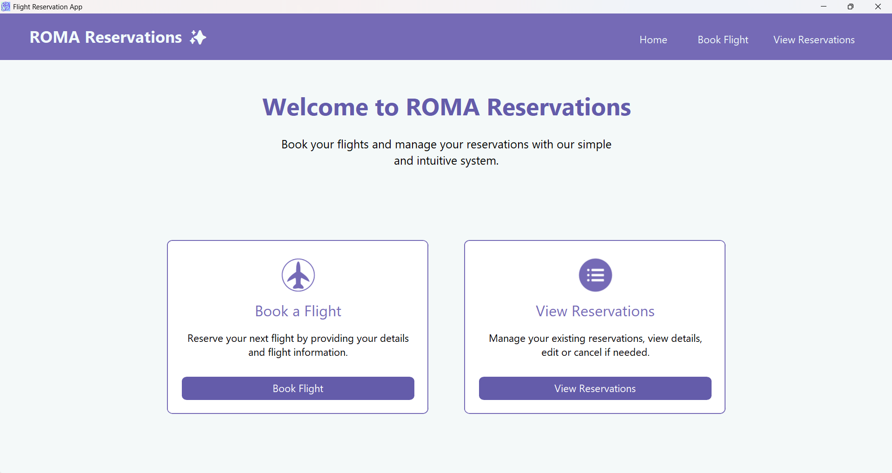
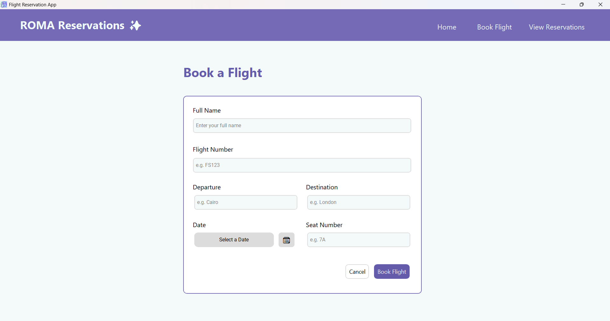
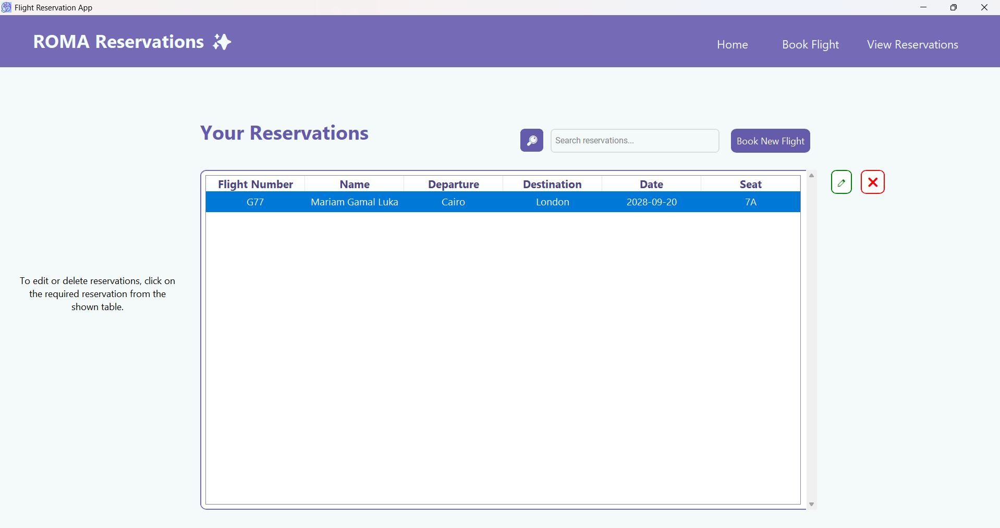

# ROMA Reservations App

### 1.Project Description 
This is a simple flight reservations app that allows the user to :  
- Book flights
- Edit reservations 
- Delete reservations
- Search reservations
- View reservations  
All with a simple user friendly GUI 
### 2.Installation  
**For insallation, there're two options:**  
- Option 1 (run as a console application) :  
This requires you to have a compiler on your machine (Visual Studio, CodeBlocks::,etc...) and install any required Python extensions.  
Then you must install all required libraries found in the requirements.txt file, by typing in your cmd: pip install -r requirements.txt  
After all required libraries are installed, you can run main.py in your cmd and the program should work.  
- Option 2 (run the windows executable file):  
This Option doesn't require you to have any compilers on your machine, just find ROMAReservations.exe in the project file and open it, this should open the program normally like a Windows application without involving compilers or cmds.  
**Note that** when you open the executable file for the first time, a file called user_data will be created in the same directory as ROMAReservations.exe, this file contains a copy of the database (flights.db) to allow you to save your reservations and not lose them once the app is closed.  
**IF YOU DELETE user_data ALL YOUR RESERVATIONS AND EDITS WILL BE LOST**

### 3.App Features  
**The app GUI is made with a mix of Tkinter and CustomTkinter to blend modern look with needed functionality, here's a detailed breakdown of all app pages (or views):**  
- Home Page  
  
Home page is the first page that opens up when the app is opened,
it has the Book a flight and View reservations options, as well as navigation buttons at the top to allow the user to 
move between all the application pages.  

- Booking Page  
   
 Booking page is where the user gets to enter their reservation details, it includes two buttons at the bottom :   
- The Book Flight button which saves the reservation into the database.   
- The cancel button which takes the user back to the home page.  

- View Reservations Page  
   
 All user reservations are saved into the database and displayed in the View reservations page in a table style, 
 user can select any reservation and the edit and delete options will pop up on the right side allowing the user to delete or edit 
 selected reservation.  
 The user can also use the search field to search their reservations, by entering any related info name or flight number, etc..  
 To reset the search and show the entire table, the user should leave the search field empty and click on the search icon, then 
 all reservations will show up again.  
 There's also a Book New Flight button at the top that takes the user to the booking page to book a new reservation.  

 - SQLite Database  
 The app features a separate database file using Pyhton's SQLite3 library, which is efficient for small projects and implements CRUD operations (Create,Read,Update,Delete) that allow for a better user experience and flexibility.  

 #### Author : Mariam Gamal Luka

